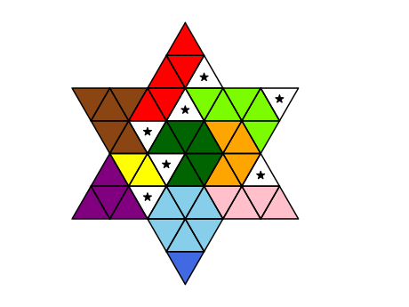

# The Genius Star Solver

[Run the solver now!](https://geniusstar.johnrudge.com)

This is a simple python solver for [The Genius Star](https://www.happypuzzle.co.uk/word-maths-and-shape-games/the-genius-star), a tiling puzzle made by the Happy Puzzle Company. The game involves tiling a star-shaped grid of triangles with a set of irregular pieces. Seven dice are rolled to indicate certain triangles which are blocked, and the other pieces must be fitted around these blocks. The tiling problem can be cast as an [exact cover problem](https://en.wikipedia.org/wiki/Exact_cover) and the code here uses the python [exact-cover package](https://github.com/jwg4/exact_cover) to do the solving.

## Requirements

The code requires python 3 with the `numpy`, `matplotlib`, and `exact-cover` packages. The GUI requires the `nicegui` package.

## Example usage

```
from genius_star import Game

roll = [4, 10, 15, 18, 28, 33, 37]
game = Game(roll)
solution = game.solve()
solution.plot()
```



## Jupyter notebook

There is a [Jupyter notebook](description.ipynb) describing the game and algorithm, which can be run directly in a web browser using services such as Colab or Binder. [](https://colab.research.google.com/drive/1SNbcegEdsjfifolCRRMD0PY8gWDynWIb?usp=sharing)
      [](https://mybinder.org/v2/gh/johnrudge/genius_star/HEAD?labpath=description.ipynb)

## GUI

There is a web-based GUI for the solver, which can be run with
```
python3 gui.py
```
or by visiting [https://geniusstar.johnrudge.com](https://geniusstar.johnrudge.com).

## All solutions

`solve_all.py` performs an exhaustive search of all 165,888 possible puzzles from rolling the dice. It takes around a minute to run, and shows that 97,422 of the combinations can be solved with a star (58.7%, slightly higher than the manufacturer's quoted figure of 57.4%). The routine exploits the symmetry of the board, namely that some dice rolls lead to puzzles which are reflections or rotations of other dice rolls e.g. the roll [4, 10, 15, 18, 28, 33, 37] is equivalent to [1, 7, 13, 22, 29, 31, 38]. Accounting for symmetry there are 24,192 unique puzzles that can be obtained with the dice (of which 14,149 have the star).

If you can place the blockers anywhere on the board there are many more possible puzzles, but they do not all have solutions. There are 73,629,072 possible placements of the seven blockers, of which 51,837,678 are solvable puzzles (70.4%) and 22,651,032 have the star (43.7% of the solvable). Accounting for symmetry, there are 6,140,978 blocker placements, with 4,322,975 solvable and 1,888,833 with the star. The puzzles given by the dice represent only 0.32% of all the solvable puzzles by placing the seven blockers on the board.
      
## License

This software is licenced under the GNU Lesser General Public License v3.0.

## Author

John F. Rudge
