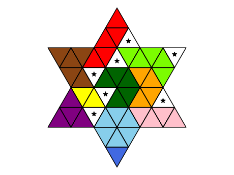

# Genius Star Solver

This is a simple python solver for [The Genius Star](https://www.happypuzzle.co.uk/word-maths-and-shape-games/the-genius-star), a tiling puzzle made by the Happy Puzzle Company. The game involves tiling a star-shaped grid of triangles with a set of irregular pieces. Seven dice are rolled to indicate certain triangles which are blocked, and the other pieces must be fitted around these blocks. The tiling problem can be cast as [exact cover problem](https://en.wikipedia.org/wiki/Exact_cover) and the code here uses the python [exact-cover package](https://github.com/jwg4/exact_cover) to do the solving.

## Requirements

The code requires python 3 with the `numpy`, `matplotlib`, and `exact-cover` packages.

## Example usage

```
from genius_star import Game

roll = [4, 10, 15, 18, 28, 33, 37]
game = Game(roll)
solution = game.solve()
solution.plot()
```



## Jupyter notebook

There is a [Jupyter notebook](description.ipynb) describing the game and algorithm, which can be run directly in a web browser using services such as Binder. [](https://mybinder.org/v2/gh/johnrudge/genius_star/HEAD?labpath=description.ipynb)

## License

This software is licenced under the GNU Lesser General Public License v3.0.

## Author

John F. Rudge
